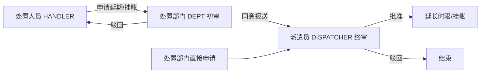

# 案件延期 / 挂账 — 设计定稿（2026-05-25，2026-06 两级审批）

## 流程（两级）

- **处置人员**：移动端/管理端提交 → 状态 `pending_dept` → **处置部门**同意报送或驳回（可写意见，如「可调库存，无需延期」）。
- **处置部门**：可直接申请 → 状态 `pending` → 跳过部门初审，直达派遣员。
- **派遣员**：仅审批 `pending` 状态；批准延期则 `extendHandleDeadline`，批准挂账则 `pauseHandleTimer`。

## 规则

| 类型 | 规则 |
|------|------|
| 延期 | 在 **当前 deadline** 上 +1 个原处置时限；**批准满 2 次** 后不可再申请；**驳回不占次数** |
| 挂账 | 自选挂账截止日期（最长 1 年）；**批准 1 次**；到期自动恢复；挂账期间不可处置 |
| 可申请状态 | `pending_handle` / `handling`，未挂账、无同类型在途申请、**处置未超时** |

## 接口

| 方法 | 路径 | 角色 |
|------|------|------|
| POST | `/case/adjustment/apply` | HANDLER→`pending_dept`；DEPT→`pending` |
| GET | `/case/adjustment/pending-dept` | DEPT 部门待审列表 |
| POST | `/case/adjustment/dept-review` | DEPT 初审 |
| GET | `/case/adjustment/pending` | DISPATCHER 待审列表 |
| POST | `/case/adjustment/review` | DISPATCHER 终审 |
| GET | `/case/adjustment/list/{caseId}` | 案件可读角色 |

## 库

- `case_adjustment_apply.apply_status`：`pending_dept` | `pending` | `approved` | `rejected`
- 部门初审字段：`dept_reviewer_id`、`dept_review_remark`、`dept_review_time`（见 `database/patch_case_adjustment_dept_review.sql`）

## 计时

- 延期：`CaseTimerService.extendHandleDeadline`
- 挂账：`pauseHandleTimer`；定时任务到期恢复
